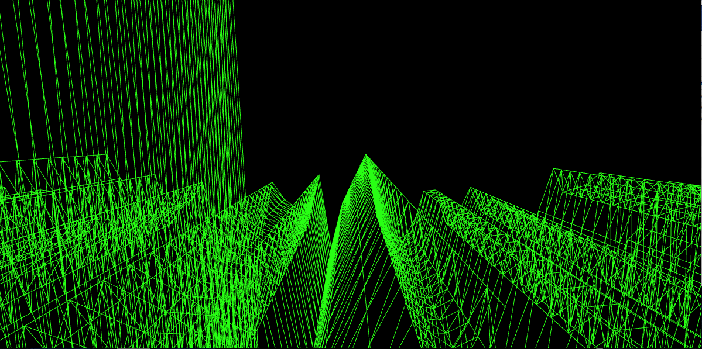

# fftTerrains

3D responsive mesh of an audio signal. Programmed on Processing-java to be run in Raspberry Pi, working also on Desktop. The program performs a FFT (Fourier Fast Transform) of the audio signal and represents the amplitudes of the frequencies in a mesh. The mesh consists of a 2D grid with its squares divided by its diagonal in triangles. Each vertex is indexed with [x][y], where [x] are the frequency bins and [y] is the timeline. The vertex are then moved in the [z] direction proportionally to the FFT amplitude.




## Requisites

### Sound Library

Download from the Import Library assistant in Processing.

### Mesa

```
sudo raspi-config
```

Under Advanced Options > GL Driver choose **GL (Full KMS)**.

### GPU

Under Raspberry Pi Configuration > Performance > set "GPU memory" higher. Reboot. If the raspberryPi doesn't boot, reboot manually and access Recovery Mode, change the config.txt file and reduce the GPU number there.


## Status

Working on Laptop (MacOS Sierra mid 2011) with high resolution. Working on on pi but much slower and only after using the experimental GL driver and after having improved the GPU. Looks like pi doesn't like processing3D (P3D). Further work: make the fft go slower (instead of performing it after n samples, perform it after 2\*n samples). At the moment it goes faster as the driver graphics can render.

## Usage

### Audio input

You can use a real time audio input or an audio file. Lossless formats like .wav are recommended since otherwise decompression takes too long.

Default configuration is using an audio file. Don't forget to add your file to your local repository and link the script to the file:

```java
sample = new SoundFile (this, "your-file.wav");
sample.loop();
fft.input(sample);
amp.input(sample);
```

If you want to use direct audio input, comment the previous block and uncomment the following block, this way:

```java
/*
//++using an audio file++
//use lossless files like .wav (decoding .mp3 makes the program go slow)
sample = new SoundFile (this, "your-file.wav");
sample.loop();
fft.input(sample);
amp.input(sample);
*/

//++microphone++
//uncomment the block below to use audio input from microphone
in = new AudioIn(this, 0);
fft.input(in);
amp.input(in);
```

### Disable full screen

You can set the size of the screen by commenting `fullScreen(P3D)` and setting your preferred window parameters in `size()`:

```java
size(1200,600,P3D);
//fullScreen(P3D);
```

### Usage on raspberryPi

On the terminal, write:

```
DISPLAY=:0 processing-java --sketch=yourdir\terrain --run
```

where `yourdir`refers to the repository folder.

#### Runing the script at boot

```
cd
sudo nano run_fftTerrain.sh
```

Inside the file write:

```
DISPLAY=:0 processing-java --sketch=/home/pi/fttTerrain/terrain --run
```

Then ctrl + X to save. You can test if it works with:

```
bash run_fftTerrain.sh
```

If it works, we need to edit the config file for the pi boot. Type:

```
sudo nano /etc/xdg/lxsession/LXDE-pi/autostart
```

and inside the file, type:

```
@bash /home/pi/run_fftTerrain.sh
```

Save and done.


## References

The initial Perlin terrain was programmed following The Coding Train tutorial: https://www.youtube.com/watch?v=IKB1hWWedMk

